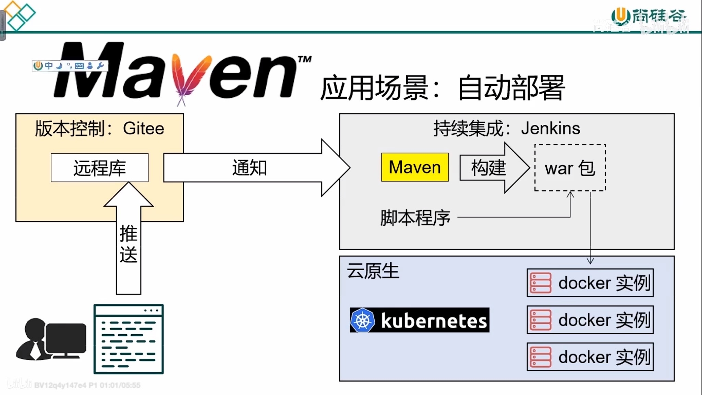
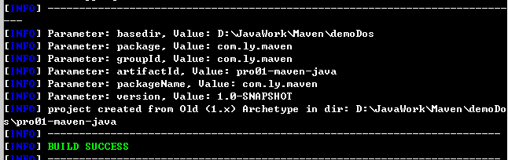
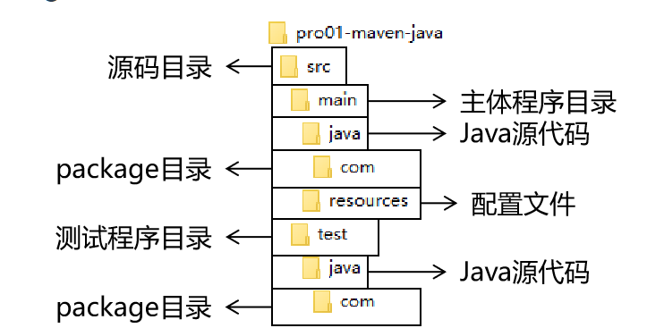
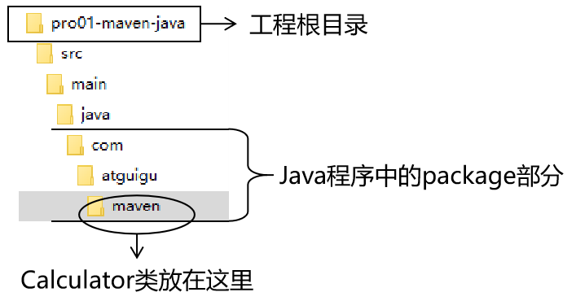

# Maven的应用场景



# Maven的作用

+ Maven可以作为jar包依赖管理工具
+ Maven作为构建管理工具

# Maven的工作机制


# Maven核心程序解压和配置

## 1、Maven核心程序解压与配置

+ 打开官网：[Maven – Download Apache Maven](https://maven.apache.org/download.cgi) 下载3.8.5版本jar包（如果有需要可以下载源码） 

+ 解压放到任意目录 `conf/settings.xml文件是Maven的核心配置文件.`

+ 配置settings.xml文件 配置本地仓库

  ```xml
  <!-- settings.xml配置文件解析-->
  <!-- localRepository代表Maven的本地仓库 默认值是Default: ${user.home}/.m2/repository 其中${user.home}如果是Windows系统就是c:/user/用户名/.m2/repository  如果指定路径文件不存在Maven会自动创建-->
  <localRepository>D:/Maven/repository</localRepository>
  ```

+ 配置阿里云提供的镜像仓库 【即本地没有这个jar包是回去此远程仓库中下载，类似于linux的npm】，即放到mirrors标签的内部 ---直接复制，手写确实会错

  ```xml
  <!-- 注意区分 mirror和mirrors标签 mirror代表镜像可以有多个-->
  <mirror>
  	<id>nexus-aliyun</id>
  	<mirrorOf>central</mirrorOf> <!--表示中央仓库镜像-->
  	<name>Nexus aliyun</name>
  	<url>http://maven.aliyun.com/nexus/content/groups/public</url>
  </mirror>
  ```

+ 配置Maven工程的基础JDK版本，因为默认是jdk1.5的，可以配成默认jdk1.8

  ```xml
  <!-- 放在profiles标签内，和mirror需要有个profile标签-->
  <profile>
  	<id>jdk-1.8</id>
  	<activation>
  		<activeByDefault>true</activeByDefault>
  		<jdk>1.8</jdk>
  	</activation>
  	<properties>
  		<maven.compiler.source>1.8</maven.compiler.source>
  		<maven.compiler.target>1.8</maven.compiler.target>
  		<maven.compiler.compilerVersion>1.8</maven.compiler.compilerVersion>
  	</properties>
  </profile>
  ```

## 2、配置Maven的环境变量

+ 配置Java环境变量，保证三个都有输出

  ```bash
  java -version;
  echo %JAVA_HOME%;
  echo %PATH%;
  ```

+ 配置MAVEN_HOME环境变量（通常指向bin目录的上一级）

  ```bash
  MAVEN_HOME = D:\Maven\apache-maven-3.8.5 #通常为bin目录的上一级
  ```

+ 配置PATH，将MAVEN_HOME加到PATH路径下

  ```bash
  PATH末尾追加：%MAVEN_HOME%/bin
  ```

+ 验证Maven环境变量，dos窗口下输入：`mvn -v`能看到版本号就ok了

# 使用Maven（dos命令行环境）

## 	1、Maven中的坐标

### 1.1、类似于数学坐标系，Maven中定位某个jar包也是使用三个向量：

+ `groupId` 公司或者组织的id
+ `artifactId` 一个项目或者是一个项目中的某一个模块的id（一般为项目中的模块/工程的id）
+ `version` 版本号

### 1.2、Maven三个向量的取值方式：

+ `groupId`：公司或者组织域名的倒序，通常也会加上项目名称

  例如：com.lxcl96.BookStore

+ `artifactid`：模块的名称，将来作为Maven工程的工程名

+ `version`：模块的版本号，自己设定

  例如：SNAPSHOT 快照 表示正在迭代，不稳定的版本

  ​			RELEASE 表示正式版本

举例：

groupId：com.ly.maven

artifactId：pro01-maven-java //工程名

version：1.0-SNAPSHOT

### 1.3、坐标和仓库中jar包的存储路径之间的对应关系

jar的jar包：

```xml
<groupId>javax.servlet</groupId>
<artifactId>servlet-api</artifactId>
<version>2.5</version>
```

则该坐标对应的 jar 包在 Maven本地仓库中的位置为：

> Maven本地仓库目录\javax\servlet\servlet-api\2.5\servlet-api-2.5.jar

## 2、实验操作

### 2.1、创建目录作为后面操作的工作空间

例如：D:\JavaWork\Maven\demoDos

说明：此时已经有三个目录了

+ Maven核心程序：D:\Maven\apache-maven-3.8.5
+ Maven本地仓库：D:\Maven\repository
+ Maven本地工作空间：D:\JavaWork\Maven\demoDos

### 2.2、使用命令生成Maven工程

`mvn archetype:generate`创建工程，同时 输入groupId,artifactId,和version

```
TIP

Choose a number or apply filter (format: [groupId:]artifactId, case sensitive contains): 7:【直接回车，使用默认值】

Define value for property 'groupId': com.atguigu.maven

Define value for property 'artifactId': pro01-maven-java

Define value for property 'version' 1.0-SNAPSHOT: :【直接回车，使用默认值】

Define value for property 'package' com.atguigu.maven: :【直接回车，使用默认值】

Confirm properties configuration: groupId: com.atguigu.maven artifactId: pro01-maven-java version: 1.0-SNAPSHOT package: com.atguigu.maven Y: :【直接回车，表示确认。如果前面有输入错误，想要重新输入，则输入 N 再回车。】
```

创建成功界面如下：



### 2.3、调整

Maven默认生成的工程，对JUnit依赖的是较低的3.8.1版本，我们可以改成合适的4.12版本

```xml
<!-- pom.xml文件中配置--> 
<dependencies>
    <dependency>
      <groupId>junit</groupId>
      <artifactId>junit</artifactId>
      <version>4.12</version>
      <scope>test</scope>
    </dependency>
  </dependencies>
```

自动生成的App.java和AppTest.java可以删除

### 2.4、pom.xml文件解析

```xml
<!-- 根标签：project 即工程，一个工程一个pom文件，表示对当前工程进行配置，管理-->
<project xmlns="http://maven.apache.org/POM/4.0.0" xmlns:xsi="http://www.w3.org/2001/XMLSchema-instance"
  xsi:schemaLocation="http://maven.apache.org/POM/4.0.0 http://maven.apache.org/xsd/maven-4.0.0.xsd">
  <!-- modelVersion是Maven 2开始固定就是4.0.0 代表当前pom.xml 所采用的标签结构-->
  <modelVersion>4.0.0</modelVersion>

  <!--gav坐标 -->
  <groupId>com.ly.maven</groupId> 
  <artifactId>pro01-maven-java</artifactId>
  <version>1.0-SNAPSHOT</version>
  <!-- packing标签 ：表示打包方式jar：表示是Java工程，war：表示是web工程，pom：说明这个工程是用来管理其他工程的工程-->
  <packaging>jar</packaging>

  <name>pro01-maven-java</name>
  <url>http://maven.apache.org</url>

  <!-- properties标签，表示可以在Maven中定义属性值。这个属性可以是Maven提供的，也可以是我们自己定义的-->
  <properties>
  <!-- 在构建过程中读取源码所读取的字符集-->
    <project.build.sourceEncoding>UTF-8</project.build.sourceEncoding>
  </properties>

<!-- 配置依赖信息-->
  <dependencies>
  <!-- dependency 标签：配置一个具体的依赖信息-->
    <dependency>
	<!-- 这就是一个坐标信息，即想要导入哪个jar包只要配置其坐标信息即可-->
      <groupId>junit</groupId>
      <artifactId>junit</artifactId>
      <version>4.12</version>
	  <!-- 表示当前依赖的生效范围，以src为根目录表示只在test目录下生效-->
      <scope>test</scope>
    </dependency>
  </dependencies>
</project>

```

### 2.5、Maven的核心概念：POM

#### (1)含义

POM：即Project Object Model项目对象模型。类似于浏览器DOM

#### (2)模型化思想

POM表示将工程抽象为一个模型，再用程序中的对象来描述这个模型。这样我们就可以用程序来管理象项目了。

#### (3)对应的配置文件

POM理念集中体现在Maven工程根目录下pom.xml这个配置文件。所有这个pom.xml文件就是Maven工程中的核心配置文件。其实学习Maven就是学习pom.xml如何配置。

### 2.6、Maven核心概念：约定的目录结构

#### （1）各个目录的作用 （这个是在超级pom中配置的）



#### （2）约定目录结构的意义

Maven为了能让构建过程能够尽可能自动化完成，所以必须约定目录结构的作用。更加方便

#### （3）约定大于配置

如果Maven没有自己进行配置，那么默认就会采用这种约定。

约定大于配置，配置大于编码。

# 实验二：在Maven工程中编写代码

## （1）主体程序 

新建的包类放在maven本地工作环境/src/main/java/com/ly下和maven目录同级别

如：在maven目录下创建Calculator文件



## （2）测试程序

和主体程序的位置一样，只是主目录main变成test

# 实验三：执行Maven的构建命令

## 1、要求

运行Maven中和构建操作相关的命令时，必须进入到pom.xml所在的目录（即Maven工程目录里）。如果没有在此目录，就执行Maven构建命令就会报错。错误信息如下：

```java
The goal you specified requires a project to execute but there is no POM in this directory
```

## 2、清理操作

```java
//删除Maven工程下的target目录（和pom文件同级）
mvn clean
```

## 3、编译操作 (target目录在根目录下，需要有代码，才会显示)

```java
//主体程序编译结果存放目录为： Maven工程路径/target/classes
mvn compile //主程序编译
    
//测试程序编译结构存放目录为：Maven工程路径/target/test-classes
mvn test-compile //测试程序编译
```

## 4、测试操作

```java
mvn test //测试报告存放目录为：target/surefire-reports
```

